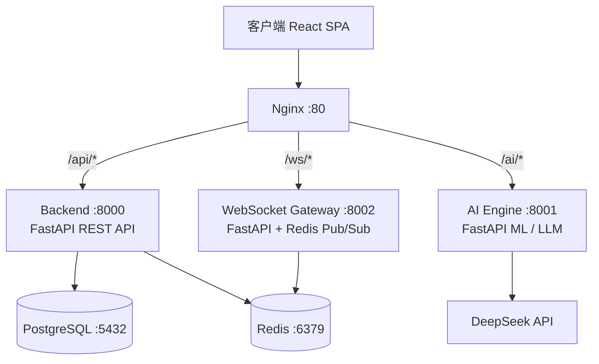
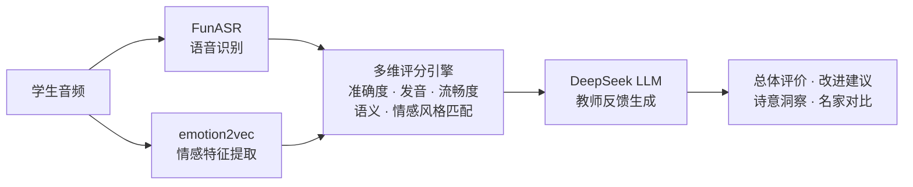

# BERP — 基于 AI 大模型的基础教育背诵评测平台

一个面向基础教育场景的智能背诵评测系统，结合语音情感识别与大语言模型，为中小学生提供多维度的背诵质量评估与拟人化教师反馈。

---

## 项目概览

传统背诵教学依赖人工评判，主观性强、反馈滞后。BERP 利用 **emotion2vec 语音情感分析** + **DeepSeek 大语言模型**，从**准确性、发音、流畅度、语义理解、情感表达**五个维度自动评估学生的背诵表现，并生成具有教学价值的个性化评语。

### 核心亮点

- **多模态 AI 评估**：ASR 语音识别 → 情感特征提取 → LLM 教学反馈，全链路自动化
- **情感感知评分**：基于 Arousal-Valence 情感空间模型，量化学生朗诵的情感表达与诗歌意境的匹配度
- **个性化基线校准**：每位学生建立独有中性朗读基线，消除个体差异，实现真正个性化的情感偏移评估
- **实时 WebSocket 反馈**：背诵过程中实时推送评估进度与中间结果
- **微服务架构**：6 个独立服务通过 Docker Compose 编排，Nginx 统一网关，支持水平扩展

---

## 系统架构



### AI 评估流水线



---

## 技术栈

| 层级 | 技术选型 |
|------|----------|
| **前端** | React 18, TypeScript, Vite 5, TailwindCSS 3.4, Zustand 4.5, React Router 6 |
| **后端** | Python 3.11, FastAPI, SQLAlchemy 2.0 (async), Alembic, Pydantic v2 |
| **数据库** | PostgreSQL 15, Redis 7 |
| **AI/ML** | PyTorch 2.4, TorchAudio 2.4, FunASR 1.1, ModelScope 1.17, emotion2vec |
| **LLM** | DeepSeek API (结构化 prompt 生成教师反馈) |
| **实时通信** | FastAPI WebSocket, Redis Pub/Sub |
| **认证** | JWT (HS256), bcrypt, OAuth2 Password Bearer |
| **基础设施** | Docker Compose, Nginx 1.27, Conda |

---

## 功能矩阵

### 学生端
- 年级/难度筛选的背诵课件库
- 自定义背诵任务创建（支持语音输入）
- 音频录制与实时上传
- 五维度量化评分 + AI 教师评语
- 个人情感基线校准
- 背诵历史与进步追踪

### 教师端
- 班级管理与学生分组
- 背诵任务布置与批阅
- 学生情感基线查看
- 批量导出评估报告

### 系统特性
- 中英双语支持 (ASR + 评估)
- 诗歌/散文/议论文多种文体
- 离线模型推理 (emotion2vec 本地部署)
- 容器化一键部署

---

## 快速启动

### 环境要求

- Docker Desktop 4.x+
- 8GB+ 可用内存
- NVIDIA GPU (可选，用于加速模型推理)

### 1. 克隆项目

```bash
git clone https://github.com/xinghuah21-source/BERP.git
cd BERP
```

### 2. 配置环境变量

```bash
# 复制示例配置
cp ai-engine/.env.example ai-engine/.env
# 编辑 .env，填入 DeepSeek API Key
```

### 3. 启动全部服务

```bash
docker compose -f orchestrator/docker-compose.full.yml up -d
```

### 4. 初始化数据库

```bash
docker compose -f orchestrator/docker-compose.full.yml exec backend python -m alembic upgrade head
docker compose -f orchestrator/docker-compose.full.yml exec backend python scripts/seed.py
```

### 5. 访问

- 前端：http://localhost
- API 文档 (Swagger)：http://localhost:8000/docs
- AI 引擎文档：http://localhost:8001/docs

### 本地开发

也可通过根目录 `Makefile` 逐个启动服务：

```bash
# 启动基础设施 (PostgreSQL + Redis)
make infra-up

# 启动 AI 引擎 (需要 Conda 环境 BERP)
make ai-run

# 启动后端
make backend-run

# 启动前端
cd frontend && npm install && npm run dev
```

---

## 项目结构

```
BERP/
├── ai-engine/                 # AI 评估引擎
│   ├── main.py                #   FastAPI 评估服务入口
│   ├── emotion2vec_infer.py   #   emotion2vec 语音情感推理
│   ├── emotion_av.py          #   Arousal-Valence 情感空间映射
│   ├── deepseek_client.py     #   DeepSeek LLM 客户端
│   ├── deepseek_prompt_builder.py  # 结构化 Prompt 构造
│   ├── audio_feature_extractor.py  # 音频特征提取
│   └── evaluator.py           #   多维评分计算
│
├── backend/                   # 业务后端 API
│   ├── app/
│   │   ├── main.py            #   FastAPI 应用入口
│   │   ├── models.py          #   SQLAlchemy 数据模型
│   │   ├── schemas.py         #   Pydantic 请求/响应模式
│   │   ├── auth.py            #   JWT 认证与授权
│   │   ├── tasks.py           #   课件任务 CRUD
│   │   └── custom_tasks.py    #   自定义任务管理
│   ├── alembic/               #   数据库迁移
│   └── tests/                 #   测试用例
│
├── frontend/                  # React 前端
│   └── src/
│       ├── pages/             #   页面组件
│       │   ├── LoginPage.tsx  #   登录页
│       │   ├── TasksPage.tsx  #   课件列表
│       │   └── RecitePage.tsx #   背诵核心流程
│       ├── components/        #   通用组件
│       │   └── recitation/    #   背诵相关组件
│       └── stores/            #   Zustand 状态管理
│
├── websocket-gateway/         # WebSocket 实时网关
│   ├── main.py                #   WebSocket 服务端
│   ├── connection.py          #   连接状态管理
│   └── audio_buffer.py        #   音频缓冲处理
│
├── orchestrator/              # 服务编排
│   ├── docker-compose.full.yml  # 完整服务编排
│   └── nginx.conf             #   Nginx 反向代理配置
│
├── verify/                    # 测试与验证脚本
└── thesis/                    # 毕业论文与附件
```

---

## 情感评估模型

本项目采用 **Arousal-Valence 二维情感空间**模型，通过 emotion2vec 提取语音情感特征后，映射到 9 种情感原型：

| 情感 | 唤醒度 (A) | 效价 (V) |
|------|-----------|---------|
| 愤怒 | 0.90 | 0.20 |
| 厌恶 | 0.60 | 0.10 |
| 恐惧 | 0.85 | 0.10 |
| 愉悦 | 0.75 | 0.85 |
| 平静 | 0.35 | 0.50 |
| 悲伤 | 0.20 | 0.15 |
| 惊讶 | 0.82 | 0.70 |

系统计算学生朗诵的情感向量与诗文预期情感向量的**余弦相似度**作为"风格匹配"分数，并结合**情感稳定性**指标（句间情感波动方差）综合评估。

### 个性化基线校准

每位学生首次使用时，朗读一段中性文本以建立个人情感基线。后续评估中，系统计算学生当前情感偏移量 (`student_offset`) 与目标偏移量 (`target_offset`)，而非绝对情感值，从而消除个体嗓音差异带来的评估偏差。

---

## License

本项目为学术毕业设计作品，仅供学习参考。

---

GitHub: [@xinghuah21-source](https://github.com/xinghuah21-source)
